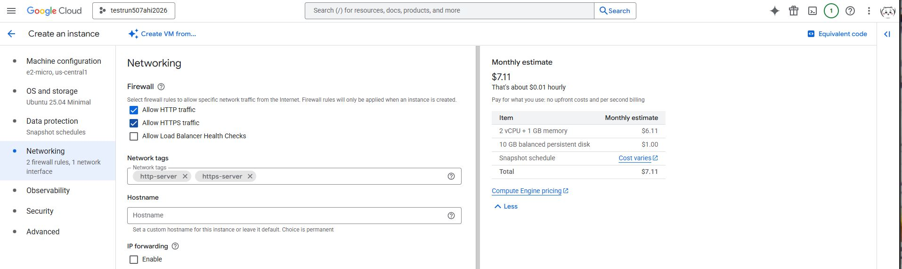
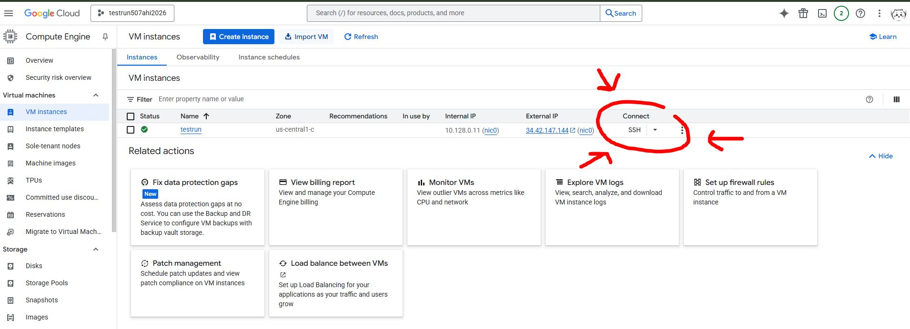
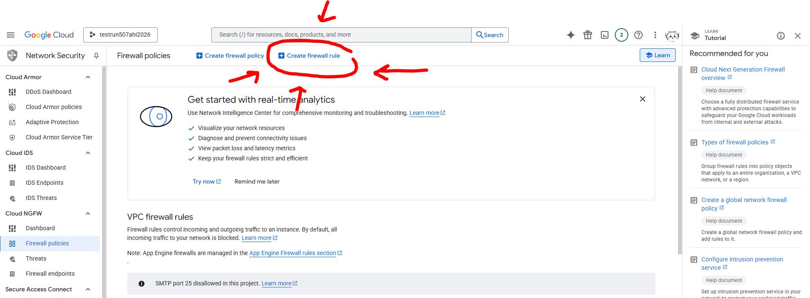
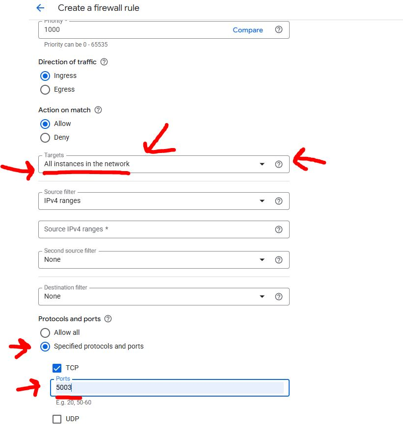

# Hello Everyone this is a tutorial on how to create a VM instance on Google Cloud with Flask Deployment

## Video links and resources: 

Video Link: https://www.youtube.com/watch?v=Y0DL8UBJM3I

Code Breakdown Video: https://www.youtube.com/watch?v=aYQn1QfHayY

resource for flask: https://flask.palletsprojects.com/en/stable/

## First step is to get code set up and pre-upload code to github repo 
Code we are using for flask application is flaskapp.py

## Second step is to set up Google Cloud VM instance
Machine configuration settings for this instance used: 
Series: E2 , Preset machine type: e2=micro(2 vCPU, 1 core, 1GB memory) 
OS: Ubuntu ,Version Ubuntu 25.04 , Size 10GB

Ensure HTTP Traffic and HTTPS Traffic is allowed under networking category

## Launch VM then go to SHH

Insert following codes
```bash
sudo apt update 
```
```bash
sudo apt install python3 python3-pip python3-venv
```
```bash
sudo apt install git
```
```bash
git clone #link for githubrepo
```
```bash
ls -l
```
```bash
cd #filename/
## include the /
```
```bash
ls -l
```
```bash
python -m venv venv
```
```bash
source venv/bin/activate
```
```bash
pip install -r requirements.txt
```
```bash
python flaskapp.py
```
HTTPS link for the app will generate but will not be functional until following steps. 

## Firewall edit

Go into fire wall box to create a new firewall rule. 
This is to enable specific generalized access than default access to 433.

Scroll down to protocols and ports to TCP type in number then create. 
For Source ivp4 insert 0.0.0.0
For this example we will be using port 5003

## Look up configuration
Once firewall edits have been made copy and paste the external IP address into the search bar. 
For example it may show up as this: 
```bash
123.45.678
```
Then once inserted, insert the port numbers used. 
```bash
123.45.678:5003
```
Dont forget, when you copy and paste external IP, convert HTTPS to HTTP  by removing the S !
